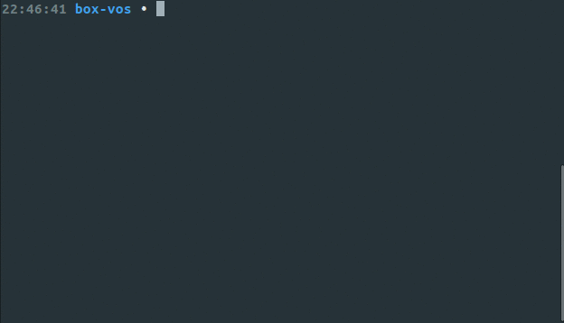

# box

Manage your machine configuration in a simple bash script.

Quickly bootstrap your personal development machines with box.

- [box](#box)
  - [Demonstration](#demonstration)
  - [Installation](#installation)
  - [Usage](#usage)
  - [Package types](#package-types)
    - [APT packages](#apt-packages)
    - [APT PPAs](#apt-ppas)
    - [Golang](#golang)
    - [Golang packages](#golang-packages)
    - [Github repositories](#github-repositories)
    - [Files](#files)
    - [Executables](#executables)
    - [Symlinks](#symlinks)
    - [Dconf Settings](#dconf-settings)
    - [File lines](#file-lines)
  - [Tasks](#tasks)
    - [Preinstall tasks](#preinstall-tasks)
    - [Postinstall tasks](#postinstall-tasks)
  - [Sections](#sections)

## Demonstration

The source for this demonstration is [here](https://github.com/AndrewVos/box-vos).



## Installation

You can bootstrap box right into your configuration script.

Place this at the top of the file:

```bash
function bootstrap-box () {
  local BOX_PATH="/usr/local/share/box/box.sh"
  if [ ! -f "$BOX_PATH" ]; then
    sudo mkdir -p `dirname "$BOX_PATH"`
    sudo wget -O "$BOX_PATH" https://raw.githubusercontent.com/AndrewVos/box/master/box.sh
    sudo chmod +x "$BOX_PATH"
  fi
  source "$BOX_PATH"
}
bootstrap-box
```

## Usage

Box allows you to configure a machine by "satisfying" dependencies.

To satisfy an [apt](#apt-packages) dependency, for example, do `satisfy apt
"package-name"`. This will ensure that the package is installed and is the
latest version.

To execute some code before or after installing a package, use [Tasks](#tasks).

For [file](#files) and [executable](#executables) tasks, box will execute a
custom function which must do the install.
You must write this function and it must be named `install-NAME`.

Whenever box executes an install- function it will cd into a directory
inside /tmp, so feel free to have at it with the file system.

## Package types

### APT packages

```bash
satisfy apt "git"
satisfy apt "vim"
```

### APT PPAs

```bash
satisfy apt-ppa "ppa:peek-developers/stable"
satisfy apt "peek"
```

### Debian packages

```bash
satisfy deb "slack-desktop" "https://downloads.slack-edge.com/linux_releases/slack-desktop-2.7.1-amd64.deb"
```

### Golang

```bash
satisfy golang "go1.9"
```

### Golang packages

```bash
satisfy go-package "github.com/AndrewVos/pwompt"
```

### Github repositories

```bash
satisfy github "https://github.com/AndrewVos/vimfiles" "$HOME/vimfiles"

if did-install; then
  cd $HOME/vimfiles
  ./install.sh
fi
```

### Files

```bash
function install-my-file () {
  cp file /my/file
}
satisfy file "my-file" "/my/file"
```

### Executables

```bash
function install-thing () {
  sudo wget -O /usr/bin/thing https://example.org/thing
}
satisfy executable "thing"
```

### Symlinks

```bash
satisfy symlink "$HOME/dotfiles/bash/.bashrc" "$HOME/.bashrc"
satisfy symlink "$HOME/dotfiles/vim/.vimrc" "$HOME/.vimrc"
```

### Dconf settings

```bash
satisfy dconf "CMD+SHIFT+s to take an area screenshot" "org.gnome.settings-daemon.plugins.media-keys.area-screenshot-clip" "<Shift><Super>s"
```

### File lines

```bash
satisfy file-line "Source my aliases" ~/.bashrc "source ~/.my-aliases"
```

## Tasks

### Preinstall tasks

```bash
if will-install apt "enpass"; then
  sudo echo "deb http://repo.sinew.in/ stable main" > /etc/apt/sources.list.d/enpass.list
  wget -O - https://dl.sinew.in/keys/enpass-linux.key | sudo apt-key add -
  sudo apt update
fi

if will-upgrade apt "enpass"; then
  echo "Upgrading enpass, no further action required"
fi

satisfy apt "enpass"
```

### Postinstall tasks

```bash
satisfy apt "vim"

if did-install; then
  echo "vim was installed"
fi

if did-upgrade; then
  echo "vim was upgraded"
fi
```

## Sections

For the obsessive among us, you can wrap sections of your config in `section` for some nesting and
a nice label:

```bash
section "VIM"
  satisfy apt "vim"
  satisfy symlink "$HOME/dotfiles/vim/.vimrc" "$HOME/.vimrc"
end-section
```

This will output something like:

```
[VIM]
  apt vim -> latest
  symlink /home/andrewvos/vimfiles/.vimrc -> latest
```

You can add as many levels of nesting as you see fit. Go wild.
